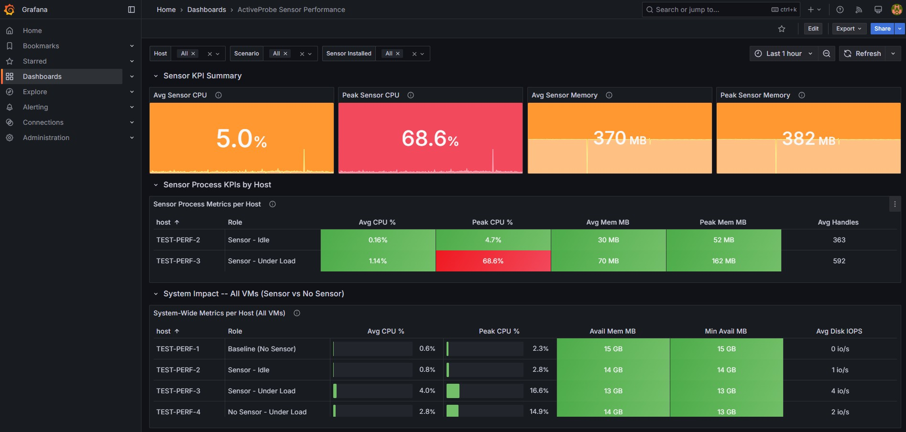
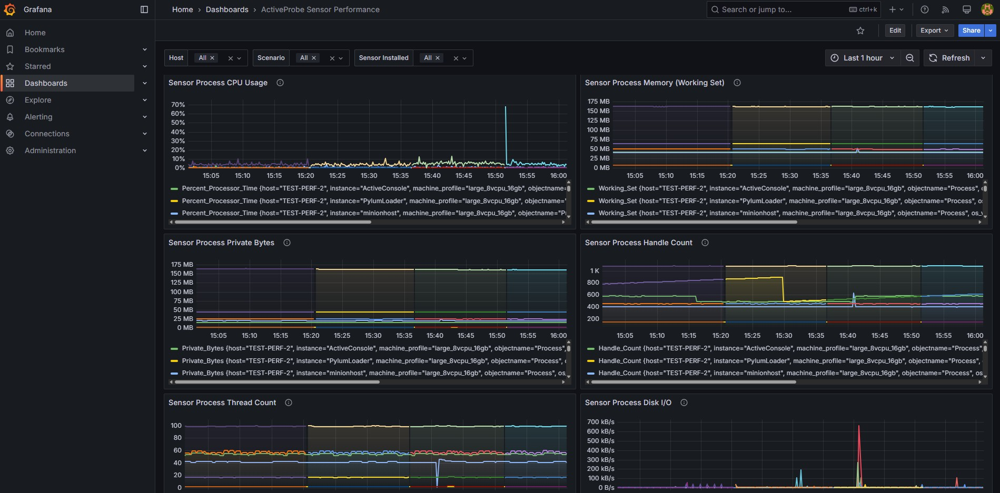
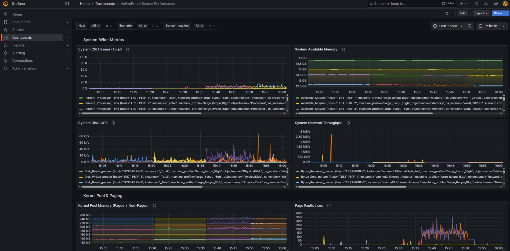
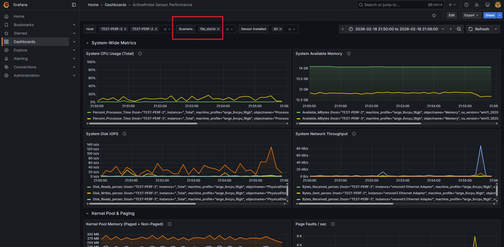
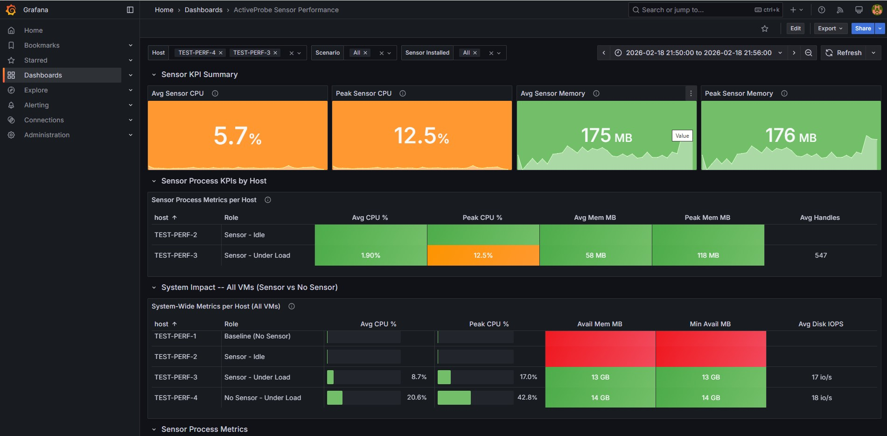

# Grafana Usage Guide -- Sensor Performance Testing

How to use Grafana to monitor, compare, and analyze sensor performance metrics.

## Overview

### What is Grafana?

Grafana is an open-source data visualization and monitoring tool. In our setup, it connects to InfluxDB (our time-series database) and displays performance metrics as interactive graphs and dashboards. Think of it as a real-time window into what's happening on your test VMs.

### How it fits into the architecture

```
Test VMs (Telegraf) --> InfluxDB (stores data) --> Grafana (shows graphs)
```

**Telegraf** on each test VM collects Windows Performance Counters every 10 seconds (CPU, memory, disk, network, plus per-process metrics for each sensor process) and sends them to **InfluxDB** on the MON VM. **Grafana** queries InfluxDB and renders the data as time-series graphs.

Each data point sent by Telegraf is tagged with:
- **host** -- which VM it came from (e.g., `TEST-PERF-3`)
- **scenario** -- which test was running (e.g., `file_stress_loop`, `idle_baseline`)
- **sensor_installed** -- whether the sensor is on this VM (`yes` / `no`)
- **sensor_version** -- sensor version (e.g., `26.1.42`), or empty for no-sensor VMs
- **num_cores** -- CPU cores for normalization (e.g., `8`); sensor CPU ÷ num_cores = % of total system

These tags are what allow you to filter, compare, and slice the data in Grafana's dashboard dropdowns. The dashboard has **num_cores** and **sensor_version** variables; use `$__all` for sensor_version to include older data with empty sensor_version.

### Where is the data stored?

All metrics are stored **automatically** in InfluxDB on the MON VM. You don't need to export or save anything manually. As long as Telegraf is running on a test VM and InfluxDB is running on the MON VM, every 10-second sample is recorded permanently. You can go back days, weeks, or months later and still see the data.

### Accessing Grafana

- **URL**: `http://<MON_VM_IP>:3000` (e.g., `http://172.46.16.24:3000`)
- **Admin login**: `admin` / (the password set during setup)
- **Viewer login**: `viewer` / (the password set for read-only access)

## Dashboard Overview

The main dashboard is called **ActiveProbe Sensor Performance**. It has several sections, each showing different aspects of the system.

Here is what the full dashboard looks like with all VMs selected:



The dashboard is organized into these sections from top to bottom:

### 1. Sensor KPI Summary (top row)

Four colored panels showing aggregate sensor metrics at a glance:

| Panel | What it shows | Color meaning |
|-------|--------------|---------------|
| **Avg Sensor CPU** | Average CPU usage across all sensor processes | Green = good, Red = high |
| **Peak Sensor CPU** | Maximum CPU spike seen | Green = good, Red = high |
| **Avg Sensor Memory** | Average memory usage across sensor processes | Green = normal, Orange = elevated |
| **Peak Sensor Memory** | Maximum memory seen | Green = normal, Orange = elevated |

These panels include small sparkline graphs so you can see the trend over time even in the summary view.

### 2. Sensor Process KPIs by Host

A comparison table showing per-VM sensor metrics with color-coded gauge bars:

| Column | Description |
|--------|-------------|
| **host** | The VM hostname |
| **Role** | Human-readable label (e.g., "Sensor - Idle", "Sensor - Under Load") |
| **Avg CPU %** | Average CPU across all sensor processes |
| **Peak CPU %** | Maximum CPU spike |
| **Avg Mem MB** | Average memory in MB |
| **Peak Mem MB** | Maximum memory in MB |
| **Avg Handles** | Average handle count (watch for growth = leak) |

Only VMs with the sensor installed appear here (TEST-PERF-2 and TEST-PERF-3).

### 3. System Impact -- All VMs (Sensor vs No Sensor)

A system-wide comparison table that includes **all VMs** -- both with and without the sensor:

| Column | Description |
|--------|-------------|
| **host** | The VM hostname |
| **Role** | Label like "Baseline (No Sensor)", "Sensor - Under Load", etc. |
| **Avg CPU %** | System-wide average CPU |
| **Peak CPU %** | System-wide peak CPU (with gauge bar) |
| **Avail Mem MB** | Average available memory |
| **Min Avail MB** | Lowest available memory seen |
| **Avg Disk IOPS** | Average disk I/O operations per second |

This is where you directly compare sensor vs. no-sensor overhead. For example, comparing TEST-PERF-3 (Sensor - Under Load) against TEST-PERF-4 (No Sensor - Under Load) tells you exactly how much CPU/memory the sensor adds.

### 4. Sensor Process Metrics (time-series graphs)

Detailed per-process graphs for each sensor component:



| Panel | What to look for |
|-------|-----------------|
| **Sensor Process CPU Usage** | Per-process CPU over time. Spikes during scenarios are expected; sustained high CPU is not. |
| **Sensor Process Memory (Working Set)** | Physical memory per process. Should be stable. A steady upward trend = memory leak. |
| **Sensor Process Private Bytes** | Committed memory. Same leak-detection logic as Working Set. |
| **Sensor Process Handle Count** | Number of OS handles. A steady climb over hours = handle leak. |
| **Sensor Process Thread Count** | Number of threads. Should be relatively flat. |
| **Sensor Process Disk I/O** | Read/write bytes per second. Spikes during file-heavy scenarios are normal. |

### 5. System-Wide Metrics (time-series graphs)

OS-level metrics for all selected VMs:



| Panel | What to look for |
|-------|-----------------|
| **System CPU Usage (Total)** | Total CPU % for each VM. Compare lines to see sensor overhead. |
| **System Available Memory** | Free RAM. Should stay stable; a downward trend means something is leaking. |
| **System Disk IOPS** | Disk operations/sec. High sustained values = disk thrashing. |
| **System Network Throughput** | Bytes in/out. Look for retry storms or unexpected traffic. |
| **Kernel Pool Memory** | Paged + nonpaged pool. Growth can indicate driver-level leaks. |
| **Page Faults/sec** | Memory pressure indicator. High sustained = the system is under memory pressure. |

## How to View a Specific Test

This is the most common task: you ran a test and want to see what happened.

### Step 1: Set the time range

Click the time picker in the top-right corner. You have two options:

- **If the test just finished**: Select "Last 1 hour" or "Last 6 hours"
- **If the test ran earlier**: Click the time picker and enter a custom absolute range. For example, if you ran `Run-AllScenarios.ps1` yesterday from 5pm to 10pm, set the range to `2026-02-18 17:00:00` to `2026-02-18 22:30:00`

### Step 2: Select the VMs

In the **Host** dropdown at the top of the dashboard, select the VMs you want to see. For a comparison:
- Select **TEST-PERF-3** and **TEST-PERF-4** to compare sensor vs. no-sensor under load

### Step 3: Filter by scenario (optional)

In the **Scenario** dropdown, you can either:
- Leave it as **All** to see all scenarios in the time range (you'll see the transitions between them as clear gaps in the graphs)
- Select a specific scenario like `file_storm` to zoom into just that workload

Here's what it looks like when you filter to a specific scenario (`file_storm`) and compare two VMs:



Notice in this screenshot:
- The **Scenario** dropdown is set to `file_storm` (highlighted with the red box)
- The **Host** dropdown has two VMs selected
- The time range is set to the exact period when that scenario ran
- The **System CPU** graph shows two lines -- one per VM -- so you can visually see the difference
- **System Disk IOPS** shows the file I/O activity pattern
- **Network Throughput** is quiet (expected -- this is a file test, not a network test)

### Step 4: Compare two VMs side-by-side

For a direct comparison of sensor overhead during a specific test:



In this view:
- **Sensor KPI Summary** panels show the sensor's average and peak CPU/memory during the selected period
- **Sensor Process KPIs by Host** table breaks it down per VM
- **System-Wide Metrics per Host** table shows ALL VMs including the no-sensor ones, so you can directly compare the CPU, memory, and IOPS between sensor and no-sensor VMs running the same workload

### Step 5: Zoom into details

- **Click and drag** on any time-series graph to zoom into a specific time window
- **Click the back arrow** next to the time picker to zoom back out
- **Hover** over any point on a graph to see the exact value and timestamp
- **Click a panel title** > **View** (or press `V`) to see a single panel full-screen

## Common Workflows

### "How much overhead does the sensor add?"

1. Select time range covering a test run
2. Select both a sensor VM and a no-sensor VM in the **Host** dropdown
3. Look at the **System-Wide Metrics per Host** table
4. Compare the **Avg CPU %** column: the difference between the sensor and no-sensor VM is the overhead
5. Do the same for **Avail Mem MB** (lower available = more consumed)

### "Is the sensor leaking memory?"

1. Select a long time range (e.g., 24 hours of soak testing)
2. Select the sensor VM in the **Host** dropdown
3. Scroll to the **Sensor Process Private Bytes** graph
4. A steadily rising line (not just spikes) = memory leak
5. Also check **Sensor Process Handle Count** -- rising handles are another leak signal

### "Which scenario caused the highest CPU?"

1. Set the time range to cover the full `Run-AllScenarios.ps1` run
2. Leave **Scenario** as **All**
3. Look at the **System CPU Usage (Total)** graph
4. You'll see distinct blocks of activity separated by 60-second gaps (the pauses between scenarios)
5. The tallest block is the most CPU-intensive scenario
6. Click and drag to zoom into that block, then check the **Scenario** dropdown to confirm which one it was

### "Show me results from a test I ran 3 days ago"

All data is stored permanently in InfluxDB. Simply:
1. Click the time picker
2. Set an absolute time range covering the period you want (e.g., `2026-02-16 09:00` to `2026-02-16 18:00`)
3. The dashboard shows exactly what happened during that period
4. Use Scenario and Host dropdowns to filter as needed

## Exporting Results

### Share a link

1. Click **Share** (top-right of the dashboard, next to the star icon)
2. Choose **Link** -- this generates a URL with the current time range and filters embedded
3. Send the link to your colleague -- they'll see the same view (they need Grafana access)

### Export a panel as CSV

1. Click a panel title
2. Select **Inspect** > **Data**
3. Click **Download CSV**
4. This gives you the raw numbers behind the graph for use in Excel or other tools

### Take a screenshot for a report

1. Set up the dashboard with the desired time range, hosts, and scenario filter
2. Use your OS screenshot tool (Win+Shift+S on Windows)
3. For a cleaner look, press `V` on a panel to view it full-screen first

### Export dashboard as PDF (via browser)

1. Set up the desired view
2. Use the browser's Print function (Ctrl+P)
3. Save as PDF

## Dashboard Controls Reference

### Time Range Picker (top-right)

- **Real-time monitoring**: Select "Last 15 minutes" or "Last 1 hour" with auto-refresh ON
- **Reviewing a past test**: Set a custom absolute time range covering the test period
- **Quick zoom**: Click and drag on any graph to zoom in
- **Zoom out**: Click the back arrow next to the time picker

### Auto-Refresh (next to time picker)

- Set to **10s** or **30s** during live monitoring
- Turn **Off** when reviewing historical data (to avoid the dashboard jumping)

### Template Variables (top of dashboard)

| Dropdown | Purpose | Tips |
|----------|---------|------|
| **Host** | Select which VMs to display | Multi-select to compare side by side |
| **Scenario** | Filter by test scenario tag | Use "All" to see transitions between tests |
| **Sensor Installed** | Filter by yes/no | Useful to isolate sensor vs. baseline VMs |

## Grafana Query Tips (Advanced)

If you want to explore data beyond the pre-built dashboards, use the **Explore** view (compass icon in the left sidebar):

**Get CPU usage for a specific host:**

```flux
from(bucket: "telegraf")
  |> range(start: -1h)
  |> filter(fn: (r) => r._measurement == "win_cpu")
  |> filter(fn: (r) => r._field == "Percent_Processor_Time")
  |> filter(fn: (r) => r.host == "TEST-PERF-3")
```

**Get sensor process memory:**

```flux
from(bucket: "telegraf")
  |> range(start: -1h)
  |> filter(fn: (r) => r._measurement == "sensor_process")
  |> filter(fn: (r) => r._field == "Working_Set")
  |> filter(fn: (r) => r.instance == "ActiveConsole")
```

**Compare two hosts:**

```flux
from(bucket: "telegraf")
  |> range(start: -1h)
  |> filter(fn: (r) => r._measurement == "win_cpu")
  |> filter(fn: (r) => r._field == "Percent_Processor_Time")
  |> filter(fn: (r) => r.host == "TEST-PERF-3" or r.host == "TEST-PERF-4")
```

## Alerts (Optional)

You can set up Grafana alerts to notify when KPIs are breached:

1. Edit a panel
2. Go to the **Alert** tab
3. Create a rule, e.g., "Alert when CPU > 15% for 5 minutes"
4. Configure a notification channel (email, Slack, etc.)

This is optional and can be configured later.
